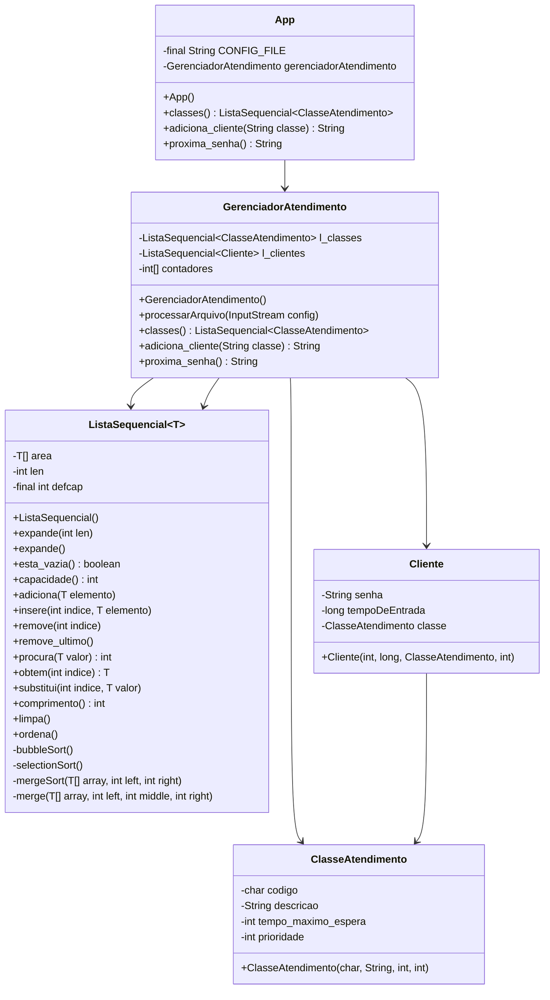

# Manual de Utilização - Sistema de Atendimento

### Introdução
Este manual descreve a implementação de um sistema de atendimento de clientes que prioriza atendimentos de acordo com a classe de atendimento e o tempo de espera de cada cliente. O sistema foi desenvolvido utilizando estruturas de dados lineares implementadas manualmente, sem uso das APIs Java.
Funcionalidades Principais

    1. Listar classes de atendimento: Exibe todas as classes configuradas no sistema
    2. Adicionar cliente à fila: Gera uma senha para o cliente baseada em sua classe
    3. Obter próxima senha: Retorna a próxima senha a ser atendida conforme as regras de prioridade

### Implementação das Operações
###### Listar Classes de Atendimento (processarArquivo(InputStream config))
Implementação:
1. As classes são carregadas do arquivo classes.csv durante a inicialização do sistema (no construtor da classe App)
2. O arquivo é processado pelo GerenciadorAtendimento que armazena as classes em uma ListaSequencial
3. A chamada ao método classes() retorna esta lista para exibição

Fluxo:
1. Arquivo CSV é lido linha por linha
2. Cada linha é dividida em campos (código, prioridade, tempo máximo, descrição)
3. Um objeto ClasseAtendimento é criado para cada linha válida
4. Todos os objetos são armazenados na lista 

###### Adicionar Cliente à Fila (adiciona_cliente(String classe))
Implementação:
1. O método adiciona_cliente(String classe) recebe o código da classe desejada
2. Verifica se a classe existe no sistema
3. Seleciona a versão mais prioritária da classe (caso haja múltiplas com mesmo código)
4. Gera uma senha no formato "CXXX" (C = código da classe, XXX = número sequencial)
5. Cria um objeto Cliente com a senha, timestamp de entrada e classe
6. Adiciona o cliente à lista de clientes em espera

Fluxo:
1. Validação da classe de entrada
2. Busca de todas as classes com o código informado
3. Seleção da classe com maior prioridade (menor valor numérico)
4. Incremento do contador específico da classe
5. Criação do cliente e adição à fila

###### Obter Próxima Senha (proxima_senha())
Implementação:
1. Verifica primeiro se há clientes que excederam seu tempo máximo de espera
    1.1 _Se múltiplos clientes excederam, seleciona o de maior prioridade_
2. Se nenhum cliente excedeu o tempo, seleciona o cliente de maior prioridade
3. Remove o cliente selecionado da fila e retorna sua senha

Fluxo:
1. Verificação do tempo de espera de cada cliente
2. Identificação de clientes que excederam o tempo máximo
3. Seleção do cliente mais prioritário entre os excedentes (se houver)
4. Caso não haja excedentes, seleção do cliente mais prioritário em geral
5. Remoção do cliente da fila e retorno da senha

### Estruturas de Dados Utilizadas
__ListaSequencial<T>__: Com finalidade de armazenar as classes de atendimento e os clientes em espera, escolhido por ser uma estrutura simples e eficiente para operações de adição, remoção e acesso por índice, e pelo fato de que a "regra de atendimento" ser simples, não necessitando de alguma estrutura complexa.

- Operações utilizadas:
    - adiciona(): Para incluir novos elementos
    - obtem(): Para acessar elementos por índice
    - remove(): Para remover clientes atendidos
    - comprimento(): Para verificar tamanho da lista
    - esta_vazia(): Para verificar se há clientes

__Array de contadores (int[])__: Com finalidade de manter contagem de clientes por classe para geração de senha.

### Diagrama

    
Diagrama

    

