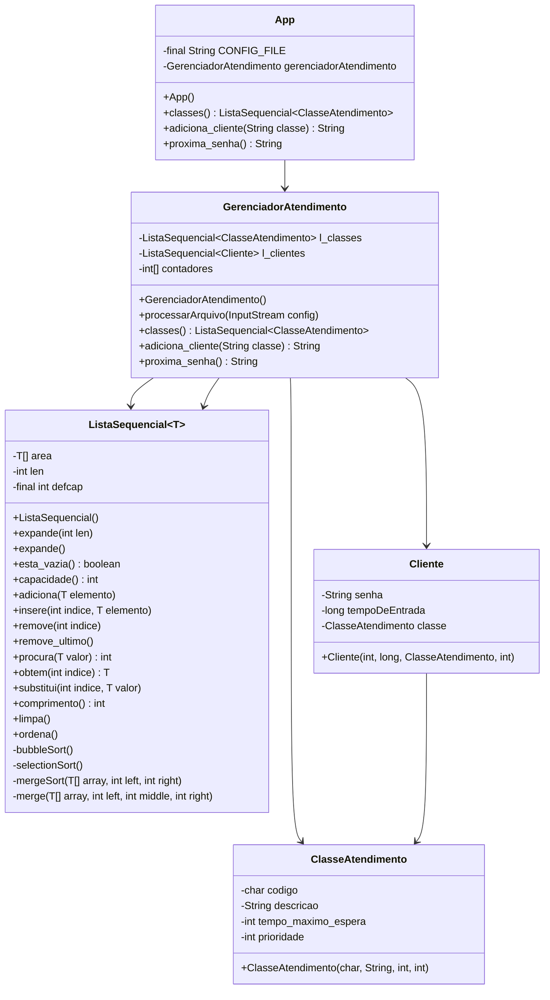

```mermaid
classDiagram
    class ListaSequencial~T~ {
        -T[] area
        -int len
        -final int defcap
        +ListaSequencial()
        +expande(int len)
        +expande()
        +esta_vazia() boolean
        +capacidade() int
        +adiciona(T elemento)
        +insere(int indice, T elemento)
        +remove(int indice)
        +remove_ultimo()
        +procura(T valor) int
        +obtem(int indice) T
        +substitui(int indice, T valor)
        +comprimento() int
        +limpa()
        +ordena()
        -bubbleSort()
        -selectionSort()
        -mergeSort(T[] array, int left, int right)
        -merge(T[] array, int left, int middle, int right)
    }

    class App {
        -final String CONFIG_FILE
        -GerenciadorAtendimento gerenciadorAtendimento
        +App()
        +classes() ListaSequencial~ClasseAtendimento~
        +adiciona_cliente(String classe) String
        +proxima_senha() String
    }

    class ClasseAtendimento {
        -char codigo
        -String descricao
        -int tempo_maximo_espera
        -int prioridade
        +ClasseAtendimento(char, String, int, int)
    }

    class Cliente {
        -String senha
        -long tempoDeEntrada
        -ClasseAtendimento classe
        +Cliente(int, long, ClasseAtendimento, int)
    }

    class GerenciadorAtendimento {
        -ListaSequencial~ClasseAtendimento~ l_classes
        -ListaSequencial~Cliente~ l_clientes
        -int[] contadores
        +GerenciadorAtendimento()
        +processarArquivo(InputStream config)
        +classes() ListaSequencial~ClasseAtendimento~
        +adiciona_cliente(String classe) String
        +proxima_senha() String
    }

    App --> GerenciadorAtendimento
    GerenciadorAtendimento --> ListaSequencial~ClasseAtendimento~
    GerenciadorAtendimento --> ListaSequencial~Cliente~
    GerenciadorAtendimento --> ClasseAtendimento
    GerenciadorAtendimento --> Cliente
    Cliente --> ClasseAtendimento
```
