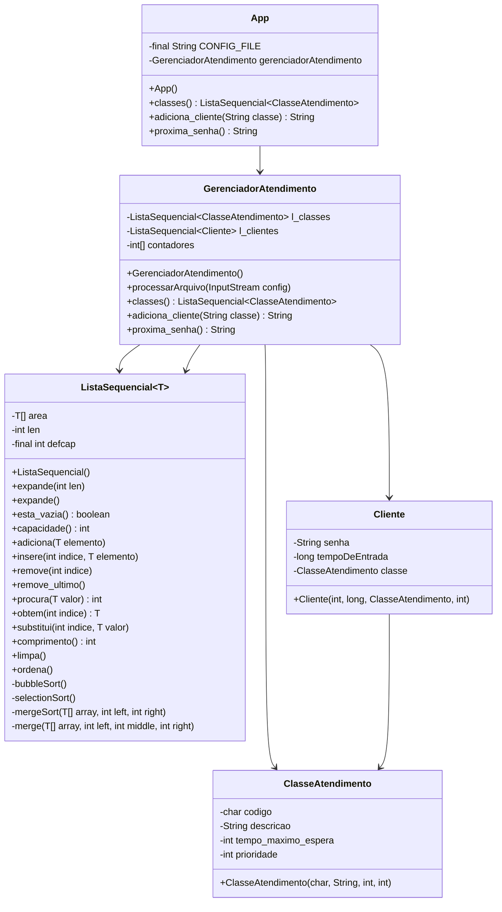

# Manual de Utilizacaoção - Fila do Pão 
_OBS: O sistema foi desenvolvido em Java, utilizando estruturas de dados customizadas (sem usar APIs prontas do Java) e um arquivo de configuração em CSV para definir as classes de atendimento._

### Funcionalidades Implementadas

### Estruturas de Dados Utilizadas
A ListaSequencial foi a estrutura unica e principal neste projeto devido às seguintes características:

Inserção (adiciona, insere)
    - Adiciona novos clientes à fila de atendimento
Remoção (remove, remove_ultimo)
    - Remove clientes atendidos da fila
Busca (procura, obtem)
    - Localiza clientes ou classes de atendimento
Vantagens para este Projeto:
    - Simplicidade: Adequada para o tamanho esperado da fila
    - Suficiência: Atende aos requisitos de prioridade baseada em:
        - Ordem de chegada
        - Tempo máximo de espera
    - Volume: O volume de dados (pequeno), permite estrutura de dados menos sofisticadas

    
Diagrama

    

